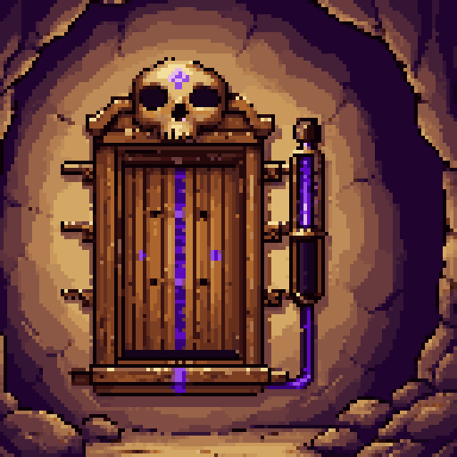
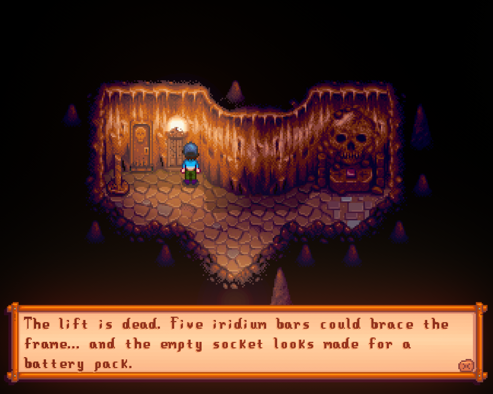
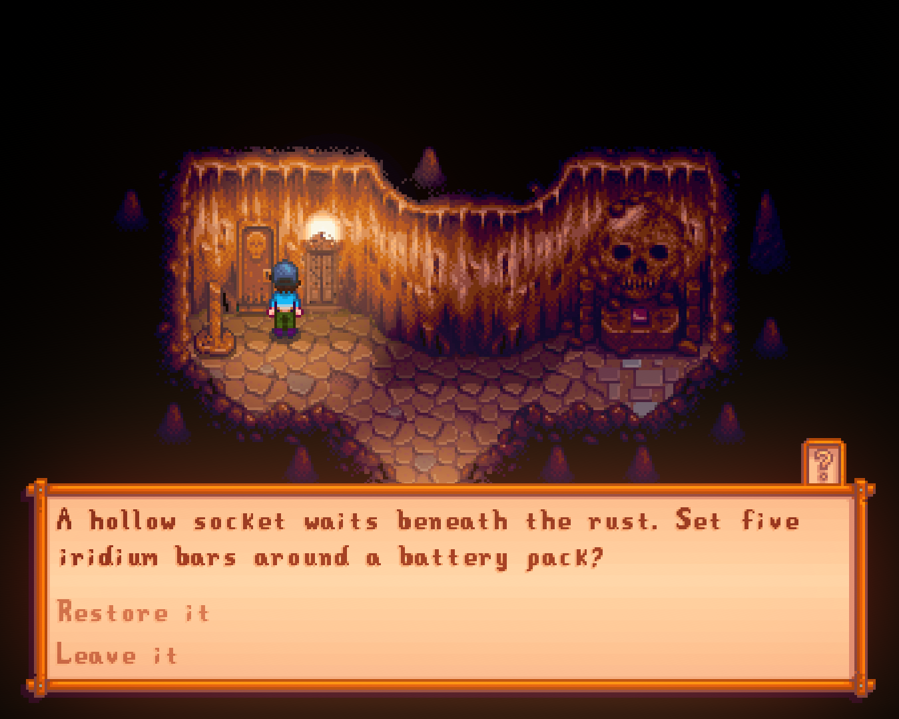
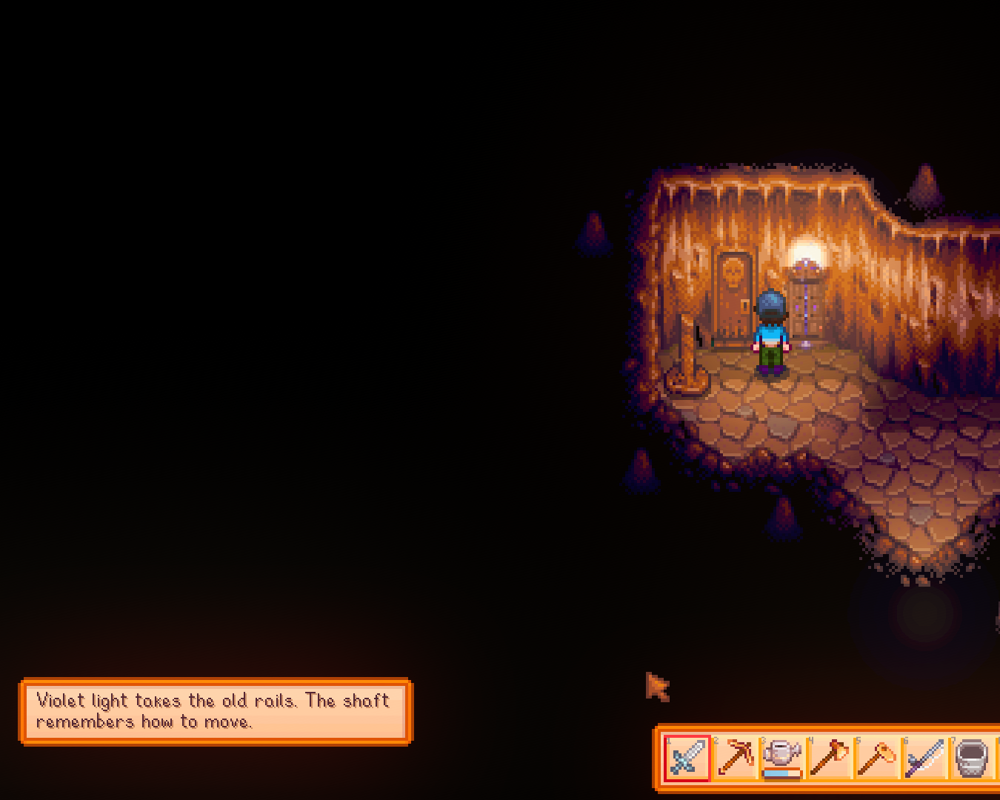
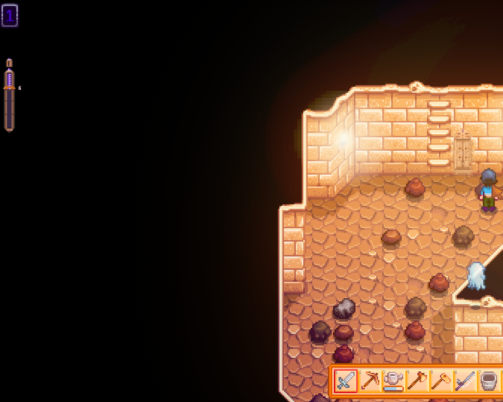
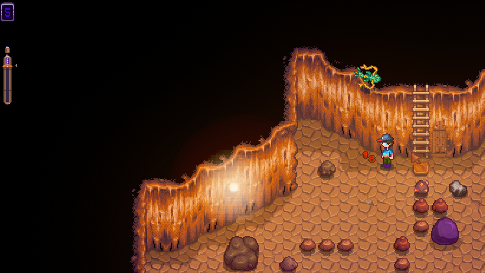

# Qi's Fading Elevator



Qi's Fading Elevator puts a broken lift beside the Skull Cavern entrance. Repair it, and the old shaft will remember the deepest floor you've reached—but the cavern slowly erases the way back.

## Screenshots

<table>
  <tr>
    <td><br><sub>Discover the dead lift and what it needs.</sub></td>
    <td><br><sub>Restore the shaft with five iridium bars and a battery pack.</sub></td>
  </tr>
  <tr>
    <td colspan="2"><br><sub>Violet light returns to the old rails.</sub></td>
  </tr>
  <tr>
    <td><br><sub>Adaptive placement and palette on a desert-themed floor.</sub></td>
    <td><br><sub>The elevator and live gauge on another generated floor.</sub></td>
  </tr>
</table>

## Features

- A broken elevator appears at the Skull Cavern entrance on a fresh save.
- Repair it with five iridium bars and one battery pack through an in-world restoration scene.
- The repaired shaft adapts its placement and palette to the entrance and generated cavern floors.
- Reaching a deeper floor teaches the shaft the way down again.
- The foothold fades every in-game hour, including time spent sleeping.
- Damage taken inside Skull Cavern knocks the remembered floor back immediately. Monster attacks, explosions, and other health loss all count, with harder hits costing more floors.
- A compact gauge inside Skull Cavern shows the live foothold against your personal record.
- Elevator destinations use configurable intervals and always include the exact remembered floor.
- Generic Mod Config Menu support is optional.

The default hourly fade is 5% of the current foothold, adjusted by daily luck. At neutral luck, floor 10 loses one floor in roughly two hours, while floor 100 loses about five floors per hour.

## Requirements

- Stardew Valley 1.6
- [SMAPI](https://smapi.io/) 4.0 or later
- [Generic Mod Config Menu](https://www.nexusmods.com/stardewvalley/mods/5098) (optional)

## Installation

1. Install SMAPI.
2. Download the latest release from [Nexus Mods](https://www.nexusmods.com/stardewvalley/mods/49301).
3. Extract the `QisFadingElevator` folder into `Stardew Valley/Mods`.
4. Start the game through SMAPI.

Once you have the Skull Key, visit the Skull Cavern entrance and inspect the broken shaft from nearby.

## Configuration

The optional Generic Mod Config Menu integration exposes:

- Master enable switch
- Destination floor interval
- Hourly fade percentage
- Daily-luck influence

## Testing commands

These SMAPI console commands are intended for development and troubleshooting:

```text
qfe_status
qfe_foothold <floor>
qfe_decay [hours]
qfe_damage [health lost] [monster|blast|other]
qfe_repair <on|off>
```

## Building from source

Install the .NET 6 SDK, Stardew Valley, and SMAPI, then run:

```powershell
dotnet build -c Release
```

The project uses `Pathoschild.Stardew.ModBuildConfig`. If Stardew Valley isn't installed in the default Windows Steam location, pass its path explicitly:

```powershell
dotnet build -c Release -p:GamePath="D:\Games\Stardew Valley"
```

## Contributing

Bug reports and focused pull requests are welcome. Please include the SMAPI log, game/mod versions, and clear reproduction steps for gameplay issues.

## Support

Qi's Fading Elevator is free. If you enjoy the mod or the other open-source work from Linh's Workshop, you can support ongoing development:

For Vietnamese users — you can support the developer via VietQR (bank transfer): [click here](https://img.vietqr.io/image/970418-8850273958-compact2.png?accountName=NGUYEN%20BAO%20LINH&addInfo=Ung%20ho%20QFE).

For international users — GitHub Sponsors is coming soon. In the meantime, you can support the developer through [Patreon](https://www.patreon.com/cw/tteokl).

## License

The source code is available under the [MIT License](LICENSE). Original visual assets in `assets/` and `docs/` use the separate terms in [ASSETS-LICENSE.md](ASSETS-LICENSE.md).

Stardew Valley is copyright ConcernedApe. This project is an unofficial fan-made mod and is not affiliated with or endorsed by ConcernedApe.
